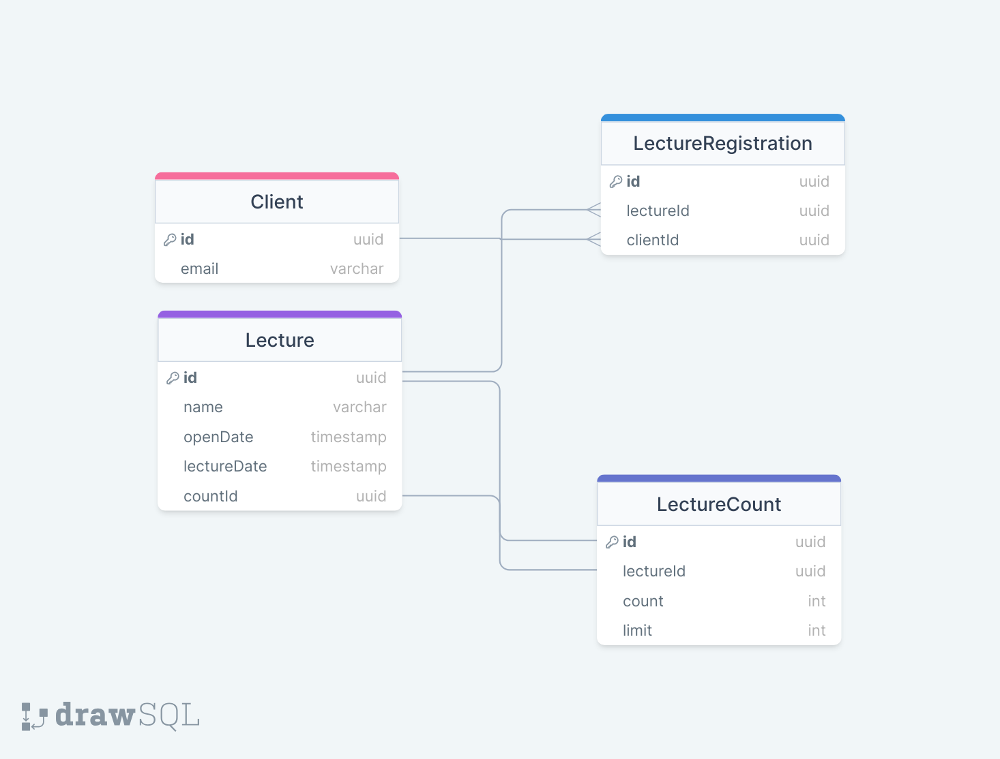

## DB Schema


## DB 설계 관점
```
1. 사용자가 특강신청을 하는 경우 특강 정보와 내가 신청한 특강정보 작업에는 영향이 없도록 LectureCount 테이블을 따로 두었다.
2. LectureCount의 특정 행에만 락이 적용되도록 배타적 락을 걸어서 동시성 문제를 해결하였다.
```

## 아키텍쳐 설계
```
1. Layered Architecture & Clean Architecture 를 혼합
2. 하나의 모듈 관점에서 Controller, Service, Repository, Entity, Dto, Interface 로 구성
3. 의존성 역전을 구현하기 위해서 Service에서 직접 Repository를 호출하지 않고 Interface를 통해 호출
```
